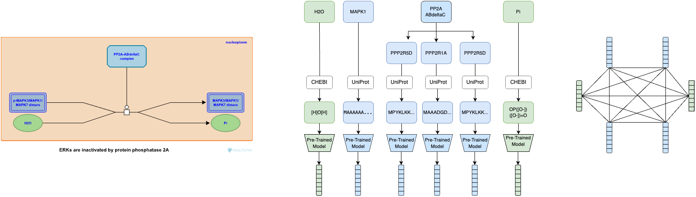

# ReactEmbed: Enhancing Protein and Molecule Representations with Biological Reactions Data

This is the official implementation for the paper "ReactEmbed: Enhancing Protein and Molecule Representations with
Biological Reactions Data".



## Setup Instructions

Follow these steps to set up the project environment and build the package:

1. Create a new Python 3.8 environment

   Using conda:
   ```bash
   conda create -n myenv python=3.8
   conda activate myenv
   ```

   Or using venv:
   ```bash
   python3.8 -m venv myenv
   source myenv/bin/activate  # On Windows, use myenv\Scripts\activate
   ```

2. Install requirements
   ```bash
   pip install -r requirements.txt 
   pip install -e ./
   ```

## Usage

### Preprocess Reactome dataset:

To preprocess the Reactome data, run the preprocess_reactome.sh script:

```bash
scripts/preprocess_reactome.sh
```

This script performs several steps to download, extract, and process the Reactome data.

### Train the ReactEmbed model:

Run the following command to train the model:

```bash
python contrastive_learning/trainer.py
```

Common arguments for training ReactEmbed:

- `--protein_embedding`: Protein embedding model to use (choices: "ProtBert-BFD", "ProtBertT5-xl", "ESM-1B", "ESM2", "
  ESM3")
- `--molecule_embedding`: Molecule embedding model to use (choices: "pebchem10m", "roberta", "chemberta")
- `--fusion_batch_size`: Batch size for fusion model training
- `--fusion_output_dim`: Output dimension of fusion model
- `--fusion_dropout`: Dropout rate for fusion model
- `--fusion_learning_rate`: Learning rate for fusion model
- `--fusion_num_layers`: Number of layers in fusion model
- `--fusion_hidden_dim`: Hidden dimension in fusion model
- `--fusion_target`: Target for fusion (e.g., 'protein' or 'all')
- `--fusion_train_all`: Whether to train on all data (1) or not (0)
- `--fusion_max_epochs_no_improve`: Maximum epochs with no improvement for fusion model
- `--use_triplet_loss`: Whether to use triplet loss (1) or not (0)
- `--fusion_epochs`: Number of epochs to train fusion model
- `--fusion_name`: Name of the fusion model

### Evaluate ReactEmbed on downstream tasks:

1. Preprocess the downstream dataset:

```bash
python eval_tasks/preprocessing.py --task_name [task_name] --protein_embedding [protein_embedding] --molecule_embedding [molecule_embedding]
```

2. Train and evaluate the model:

```bash
python eval_tasks/trainer.py --task_name [task_name]
```

Common arguments for evaluation:

- `--task_name`: Name of the task to run (choices: "BetaLactamase", "Fluorescence", "Stability", "HumanPPI", "
  BindingDB", "BACE", "BBBP", "ClinTox", "SIDER", "DrugBank", "Davis")
- `--protein_embedding`: Protein embedding model to use
- `--molecule_embedding`: Molecule embedding model to use
- `--downstream_batch_size`: Batch size for downstream task
- `--downstream_learning_rate`: Learning rate for downstream task
- `--downstream_num_layers`: Number of layers in downstream model
- `--downstream_hidden_dim`: Hidden dimension in downstream model (-1 for auto)
- `--downstream_dropout`: Dropout rate for downstream model
- `--print_downstream_results`: Whether to print downstream results (1) or not (0)
- `--use_fusion_for_downstream`: Whether to use fusion model for downstream task (1) or not (0)
- `--use_pretrained_for_downstream`: Whether to use pretrained model for downstream task (1) or not (0)

## Citation

If you use this code, please cite our paper:

```bibtex
@article{reactembed2023,
  title={ReactEmbed: Enhancing Protein and Molecule Representations with Biological Reactions Data},
  author={[Author names]},
  journal={[Journal]},
  year={2023}
}
```
